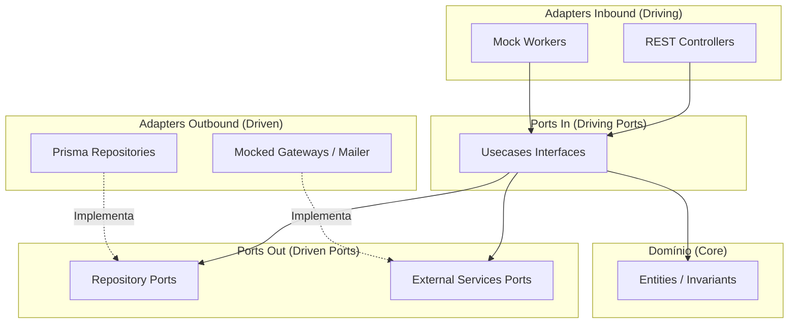

# Veridit Core
### Monólito Modular Hexagonal
#### Evolução do Projeto, Padrões SOLID e Arquitetura Hexagonal

<br>
<div style="font-size: 0.8em; color: #888;">
Engenharia de Software I (UFBA) - Trabalho III <br>
Apresentação de Evolução do Projeto
</div>

---

## Agenda

1. **Visão Geral e Linha do Tempo**
2. **Principais Milestones (Histórico Git)**
3. **Arquitetura Hexagonal na Prática**
4. **Padrões SOLID Aplicados**
5. **Decoupling Assíncrono (ADR-012)**

---

## 1. Visão Geral da Evolução

O projeto evoluiu em 4 etapas lógicas para alcançar o estado atual:

* **Fase 1: Fundação & Modelagem**
  * Criação do esqueleto modular do NestJS (Back) e React Vite (Front).
  * Definição do esquema Prisma (PostgreSQL) com as entidades base (`User`, `Record`).
* **Fase 2: Proteção & Interface**
  * Importação dos componentes visuais do Figma para o frontend.
  * Implementação de segurança: habilitação do CORS e proteção das rotas via JWT Guards.
* **Fase 3: Lógica de Negócio & Mocks**
  * Criação do módulo de compras de créditos (`credits`).
  * Implementação de simuladores (Mocks) para envio de e-mails, gateways de pagamento e registros de auditoria.
* **Fase 4: Comunicação Reativa (Event-Driven)**
  * Desacoplamento via eventos internos assíncronos (`EventEmitter2`), mitigando gargalos de processamento em tempo real.

---

## 2. Linha do Tempo do Git (Milestones)

A evolução detalhada conforme o histórico do repositório:

* **`53ce8fb` (Initialization):** Criação da estrutura de pastas de domínio, portas e adaptadores.
* **`ff9ff23` (Figma integration):** Sincronização do frontend com o design system do Figma.
* **`8b3e7bc` & `eb79e69` (Security):** Proteção de rotas confidenciais de auditoria e captura com JWT Guards.
* **`fc779a6` (Credit module):** Lançamento do módulo de créditos com persistência e mocks de infraestrutura.
* **`713369f` (Event-driven feat):** Introdução do `EventEmitter2` para compras e notificações de captura assíncronas.
* **`7868e9f` & `42ba463` (Dynamic pages):** Criação de endpoints dinâmicos de auditoria para detalhes de registros integrados com a UI.

---

## 3. Arquitetura Hexagonal (Ports & Adapters)

O sistema isola a lógica de negócio do ecossistema tecnológico (Frameworks, ORMs, Gateways).

---


<!-- element style="scale:4" -->

---

## Estrutura Modular no Código

A divisão de responsabilidades é refletida rigorosamente na árvore de arquivos:

```text
src/modules/capture/
├── domain/                      # Regras puras e entidades (ex: Capture)
├── application/
│   ├── ports/
│   │   ├── in/                  # Casos de uso (Driving Ports)
│   │   └── out/                 # Persistência e Integrações (Driven Ports)
│   └── usecases/                # Orquestradores da aplicação
└── infrastructure/
    └── adapters/
        ├── inbound/             # Controladores REST, Event Listeners
        └── outbound/            # Prisma, Gateways mockados
```

---

## 4. SOLID: S - Single Responsibility Principle

* **Onde foi aplicado:** Entidades de domínio (ex: `User`, `Record`) e serviços de Casos de Uso (ex: `BuyCreditsService`, `StartCaptureService`).
* **Justificativa:** 
  * As entidades validam apenas regras de negócio (ex: consistência de e-mail e CPF), contendo zero lógica de persistência.
  * Cada caso de uso realiza um único fluxo específico. O `BuyCreditsService` não se preocupa em salvar logs de auditoria ou gerenciar sessões de usuários; ele foca apenas na orquestração da aquisição de créditos.

---

## SOLID: O - Open/Closed Principle

* **Onde foi aplicado:** Interfaces de portas de saída (ex: `PaymentGatewayPort`, `EmailServicePort`).
* **Justificativa:** 
  * O core da aplicação está **aberto para extensão**, mas **fechado para modificação**.
  * Se for necessário trocar o gateway de pagamento (ex: de *MockPaymentGateway* para *Stripe*), criamos uma nova classe na infraestrutura implementando a interface `PaymentGatewayPort`. 
  * **Nenhuma linha de código** do core de negócio (`BuyCreditsService`) é alterada.

---

## SOLID: L - Liskov Substitution Principle

* **Onde foi aplicado:** Adaptadores de infraestrutura outbound.
* **Justificativa:** 
  * Os serviços da camada de aplicação interagem exclusivamente com as interfaces (`ports/out`).
  * Qualquer adaptador que implemente a interface (ex: `PrismaUserRepository` substituindo `UserRepositoryPort`) funciona perfeitamente sem alterar a integridade e sem quebrar o comportamento do caso de uso.

---

## SOLID: I - Interface Segregation Principle

* **Onde foi aplicado:** Segregação de portas de entrada e saída por propósito.
* **Justificativa:** 
  * Interfaces gigantescas foram evitadas. Em vez de uma interface global `UserService`, foram criadas interfaces segregadas por operação:
    * `RegisterUserUseCase`
    * `LoginUseCase`
    * `RecoverPasswordUseCase`
  * Desta forma, os controladores importam apenas as interfaces cujos métodos eles de fato consomem.

---

## SOLID: D - Dependency Inversion Principle

* **Onde foi aplicado:** Injeção de dependências no NestJS via tokens customizados.
* **Justificativa:** 
  * A camada de negócio (`application`) **não depende** da camada física (`infrastructure`). Ambas dependem de abstrações (as Portas).
  * A inversão ocorre porque o framework injeta a implementação da infraestrutura na aplicação usando tokens de portas:

```typescript
// A aplicação define o contrato e o token da dependência
@Injectable()
export class BuyCreditsService implements BuyCreditsUseCase {
  constructor(
    @Inject(CreditTransactionRepositoryPortToken) 
    private readonly repo: CreditTransactionRepositoryPort,
    @Inject(PaymentGatewayPortToken) 
    private readonly paymentGateway: PaymentGatewayPort
  ) {}
}
```

---

## 5. Eventos Assíncronos & Desacoplamento (ADR-012)

A evolução recente do projeto introduziu arquitetura reativa para evitar bloqueios de thread principal:

* **Problema:** Envio de e-mails de confirmação e processamentos pesados de captura de telas eram executados de forma síncrona, aumentando o tempo de resposta das APIs.
* **Solução (ADR-012):** Desacoplamento via eventos com `EventEmitter2`.
* **Como funciona:**
  1. O caso de uso processa a lógica de negócio e persiste o estado.
  2. Um evento (ex: `credit.purchased`) é disparado de forma *fire-and-forget*.
  3. Listeners assíncronos (`CreditEmailListener` e `MockCaptureWorker`) interceptam o evento e executam as tarefas lentas em segundo plano, liberando a requisição do usuário de imediato.

---

# Conclusão

* **Fidelidade Arquitetural:** O monólito modular preserva fronteiras bem delimitadas entre os domínios (Audit, Capture, Credits, Users).
* **SOLID Concretizado:** A arquitetura de portas e adaptadores é um reflexo direto da aplicação de DIP, OCP e LSP no nível de arquitetura de software.
* **Aptidão para Evolução:** Com o desacoplamento por eventos (ADR-012) e isolamento hexagonal, migrar para microsserviços ou trocar banco de dados torna-se uma tarefa trivial e de baixíssimo impacto.

---
#slide #eng_software
